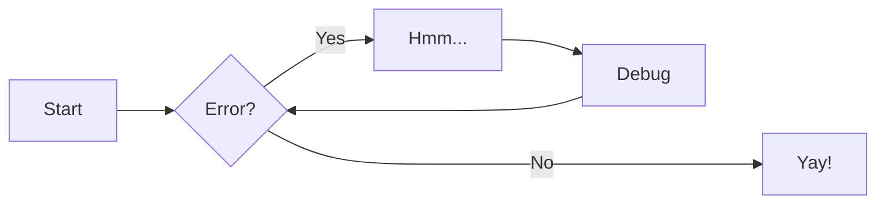
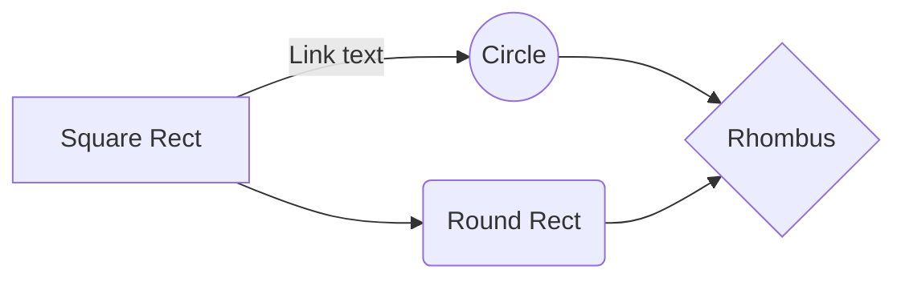
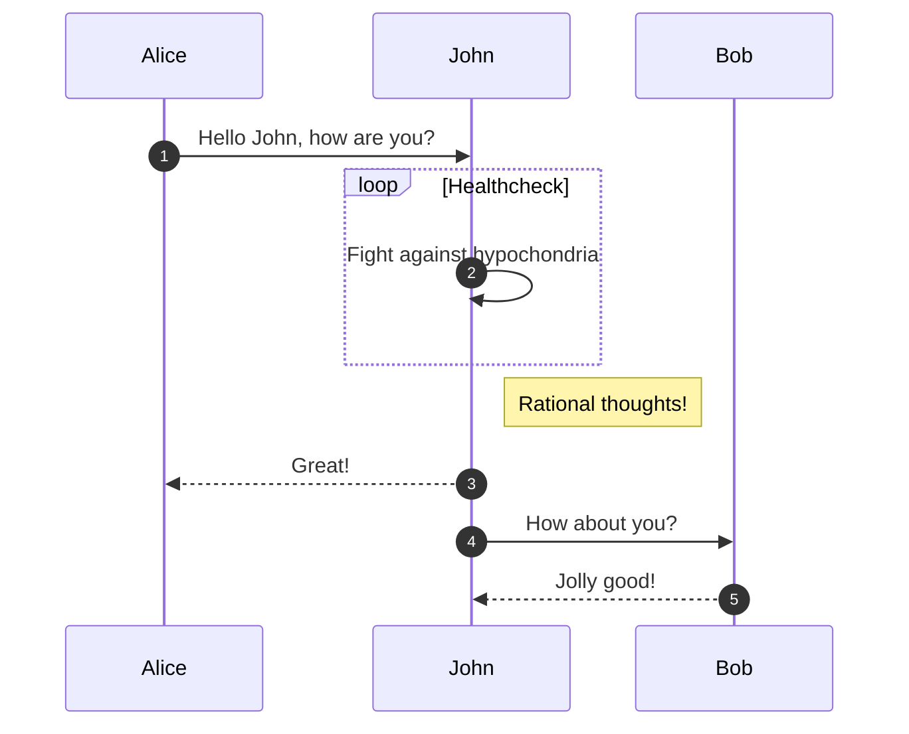
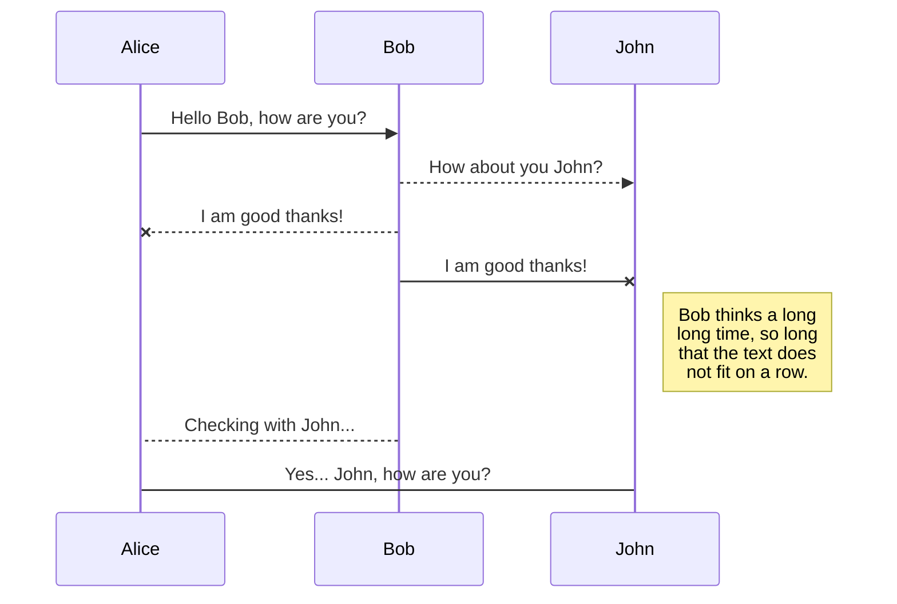
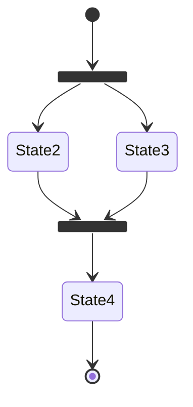
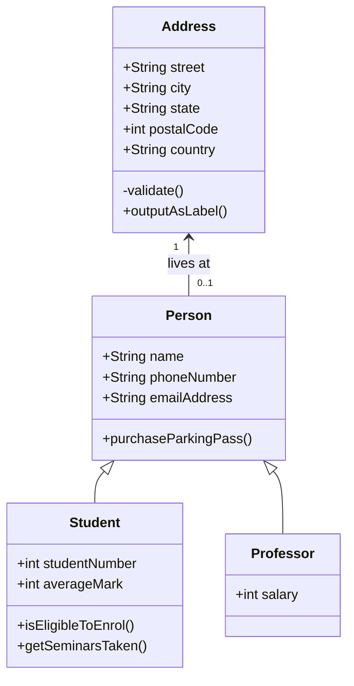
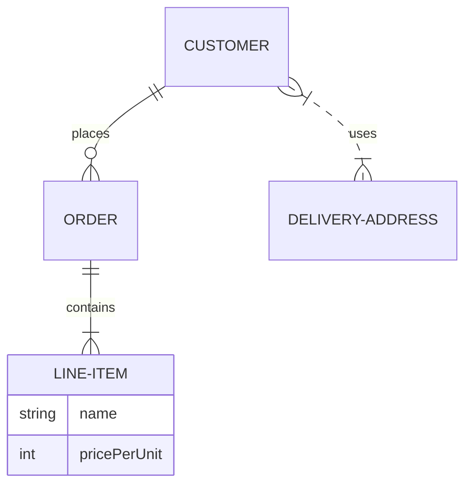

# Diagramas

Podemos criar diversos diagramas UML com a notação [Mermaid](https://mermaidjs.github.io/). Abaixo segue alguns exemplos.


## Diagrama de Atividades

### Exemplo 1



```
    ``` mermaid
    graph LR
      A[Start] --> B{Error?};
      B -->|Yes| C[Hmm...];
      C --> D[Debug];
      D --> B;
      B ---->|No| E[Yay!];
    ```
```

### Exemplo 2



```
    ``` mermaid
    graph LR
    A[Square Rect] -- Link text --> B((Circle))
    A --> C(Round Rect)
    B --> D{Rhombus}
    C --> D
    ```
```


## Diagrama de Sequência

### Exemplo 1



```
    ``` mermaid
    sequenceDiagram
      autonumber
      Alice->>John: Hello John, how are you?
      loop Healthcheck
          John->>John: Fight against hypochondria
      end
      Note right of John: Rational thoughts!
      John-->>Alice: Great!
      John->>Bob: How about you?
      Bob-->>John: Jolly good!
    ```
```

### Exemplo 2



```
    ```mermaid
    sequenceDiagram
    Alice ->> Bob: Hello Bob, how are you?
    Bob-->>John: How about you John?
    Bob--x Alice: I am good thanks!
    Bob-x John: I am good thanks!
    Note right of John: Bob thinks a long<br/>long time, so long<br/>that the text does<br/>not fit on a row.
    
    Bob-->Alice: Checking with John...
    Alice->John: Yes... John, how are you?
    ```
```


## Diagrama de Estado




```
    ``` mermaid
    stateDiagram-v2
      state fork_state <<fork>>
        [*] --> fork_state
        fork_state --> State2
        fork_state --> State3
    
        state join_state <<join>>
        State2 --> join_state
        State3 --> join_state
        join_state --> State4
        State4 --> [*]
    ```
```


## Diagrama de Classe



```
    ``` mermaid
    classDiagram
      Person <|-- Student
      Person <|-- Professor
      Person : +String name
      Person : +String phoneNumber
      Person : +String emailAddress
      Person: +purchaseParkingPass()
      Address "1" <-- "0..1" Person:lives at
      class Student{
        +int studentNumber
        +int averageMark
        +isEligibleToEnrol()
        +getSeminarsTaken()
      }
      class Professor{
        +int salary
      }
      class Address{
        +String street
        +String city
        +String state
        +int postalCode
        +String country
        -validate()
        +outputAsLabel()  
      }
    ```
```


## Diagrama de Banco de Dados MER



```
    ``` mermaid
    erDiagram
      CUSTOMER ||--o{ ORDER : places
      ORDER ||--|{ LINE-ITEM : contains
      LINE-ITEM {
        string name
        int pricePerUnit
      }
      CUSTOMER }|..|{ DELIVERY-ADDRESS : uses
    ```
```